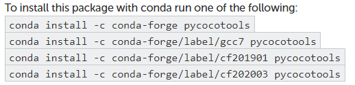

## pycocotools는?
---
pycocotools는 obeject detection, face detection 등 어떤 객체를 검출하는 vision 분야 딥러닝에서 접할 수 있습니다. pycocotools는 COCO(*Comon Object COntext*)의 `.json` 파일을 손쉽게 다룰 수 있는 패키지입니다. 실제로 COCO의 데이터 셋 뿐만 아니라, 검출 계열에서 annotation으로 많이 제공됩니다.
<a style='display: block;text-align: center;' href='https://cocodataset.org/#download'>
    

        
    

</a>

위의 사진에 COCO의 데이터셋 링크를 첨부해두었습니다. Object Detection을 공부할 때 좋은 데이터들이 많습니다. 이러한 COCO의 json에 대해서는 [아직 없음]('https://chaaaning.github.io')에 더 자세히 기술해 보겠습니다.

## pycocotools의 설치
---
여러 번의 오류를 겪으면서 설치할 수 있는 네 가지 방법 정도를 알게 되었습니다. 이는 다음과 같습니다.

1. `pip install pycocotools`
2. `conda install -c conda-forge pycocotools`
3. `pip install 'git+https://github.com/philferriere/cocoapi.git#egg=pycocotools&subdirectory=PythonAPI'`
4. **`PyPl에서 직접 설치`**

결론부터 말하자면 저는 4번의 방법으로 성공했습니다. 다 실패하고 쓰는 글이기 때문에 실패 과정의 이미지는 없습니다.😞 우선 저는 생소한 패키지를 설치할 때, 무작정 `pip install packages`를 하기 보다는 구글에 `pycocotools install`과 같은 식으로 검색을 합니다. 그럼 보통 conda나 PyPl에서 제공하는 커맨드를 입력합니다.

### `pip install pycocotools`
---
해당 커맨드는 제 기억으로 `Visual Studio 14+` 버전 설치에 대한 에러가 출력되었습니다. 따라서 `Visual Studio 14+` 빌드 도구까지 설치해 보았지만 해결되지 않았습니다.

### `conda install -c conda-forge pycocotools`
---
웬만해서는 실패율이 거의 없는 커맨드가 conda 커맨드입니다. 구글에 검색했을 때 보시면, 

    

*conda 홈페이지에서 제공하는 커맨드*

*conda 홈페이지에서 제공하는 커맨드*

